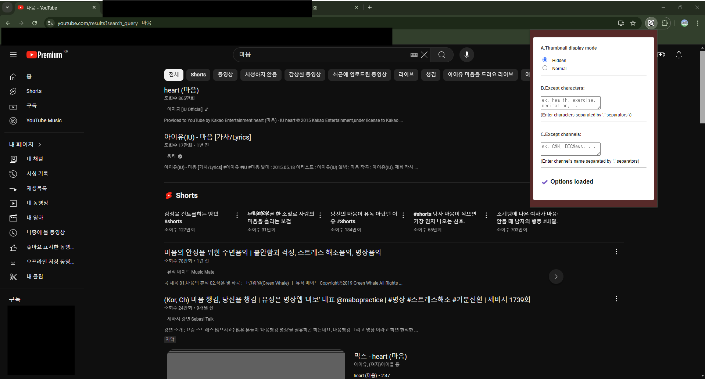
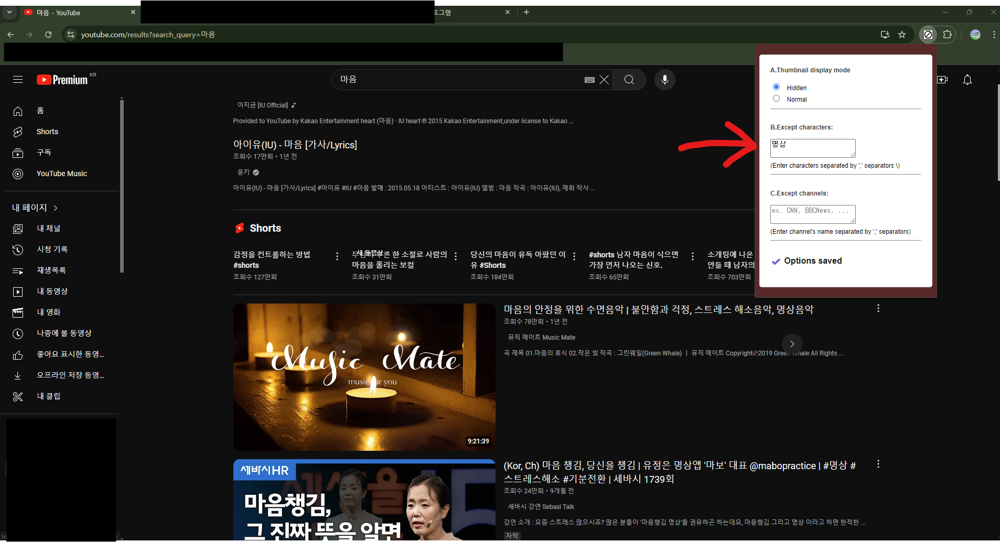

# 🫷Block youtube thumbnails 
저는 유튜브를 자주 사용하는데, 유튜브 썸네일이 주의력을 자꾸 빼앗아갑니다. 

원하는 영상을 검색해서 보더라도, 추천영상이나 관련영상들의 썸네일이 시선을 빼앗아가서 결국 시간을 낭비하게 됩니다.

그래서 썸네일을 차단하는 확장 프로그램을 개발하였습니다.

개발 후 이 기능을 사용하면서 시각적 이미지가 글자와 비교해서 얼마나 자극적인지 더욱 체감하게 되었습니다.

개발하기전,

[hideytthumbnails-extension](https://github.com/domdomegg/hideytthumbnails-extension)

이미 크롬 확장기능으로 썸네일을 가리는 프로그램이 존재했습니다. 
하지만, 제 요구에 맞게 필요한 기능들인
```
1) 내가 설정한 키워드나, 채널에 한해서는 썸네일을 가리지 않는 기능
2) 확장기능 popup에서 옵션(썸네일을 블락 여부, 선택어 입력 등)을 선택하는 기능
```

들이 없기 때문에, 이 기능들을 추가하여 개발하였습니다.

#
# 0. Preview
 ### 1. Display Mode: Hidden 처리시
: 썸네일 사라짐.



 ### 2. Display Mode: Hidden 후, 제외 검색어 "명상" 입력.
: 제목에 "명상" 키워드가 포함된 영상의 썸네일은 보여짐.


#
# 1. Install

### prerequisite
> Chrome browser

#### A. 자동설치(확장프로그램)
```

```
#### B. 수동설치
```
저장소 복제
chrome://extensions로 이동
우측 상단 개발자모드 ON
좌측 상단 "압축해제된 확장 프로그램을 로드합니다"클릭 후 복제한 폴더 업로드
```
#
# 2. 오버뷰/ 스택


[출처:velog.io/@minchoi/크롬-확장-프로그램-분석기-biauhudi]

기본 웹과 크롬 API를 사용하여 개발.

- HTML,CSS,JavaScript
- chrome API (chrome.storage)

#
# 3.git commit 메시지 규약
> * ➕ FEAT: 새로운 기능 추가
> * ❗ FIX: 버그 수정
> * 📝 DOCS: 문서 수정
> * 🎨 STYLE: 스타일 관련 기능
> * ⬆️ REFACTOR: 코드 리팩토링
> * 🔎 TEST: 테스트 코드 추가
> * ⚙ CHORE: 빌드 업무 수정, 패키지 매니저 수정(ex .gitignore 수정 같은 경우)

제목을 넘어, 본문 작성 필요시 '어떻게' 변경했는지 보다 '무엇을, 왜' 변경했는지 작성한다.
#
# 4. 이슈 및 해결

## 4-1. 페이지 변경 시 update
 페이지 변경 시 확장프로그램 기능이 적용되기 위해서, 
 아래와같이 인터벌을 활용했다.
 ```
//페이지 경로 변경 시 업데이트 
setInterval(() => {
  if (lastPathname !== window.location.pathname) {
    lastPathname = window.location.pathname
    update()
  }
}, 200);
```
위 코드는 페이지 변경 시 잘 작동되었지만, 새로고침시에는 적용되지 않았다.  

새로고침 시에는 경로이름이 같기 때문에 발생하는 문제였고, 간단하게  ```update();```으로 수정하여 페이지 로드시마다 항상 update가 실행되도록 변경하였다.

## 4-2. 키워드로 예외처리된 썸네일들을 다시 숨기기
Hidden 기능으로 썸네일을 모두 가렸지만, ```공부```라는 키워드를 설정해서 ```공부```가 제목에 포함된 영상들은 보이도록 했다.  

하지만 ```공부```라는 키워드를 제거했을 때, 다시 썸네일이 숨겨져야 하는데 그렇지 않았다.  
다시 숨겨야할 썸네일을 가져올때,
```
const exceptedThumbnails = document.querySelectorAll('style[thumbnail-block="true"]');
```
위와 같이 'style[thumbnail-block="true"]'라는 속성을 가지고 예외처리된 썸네일들을 가져오고  
썸네일 예외처리시,
```
thumbnail.style.setAttribute('thumbnail-block', 'true');
```
위와 같이 하고 있었다.

문제는 <U>**스타일을 적용하는 인터페이스에 대고 속성값을 부여하고 있었다.**</U>

-'style[thumbnail-block="true"]' 에서의 style은 \<style> 이라는 태그를 의미  
-thumbnail.style 이라는 style 객체는 HTML요소에 직접 스타일을 적용하는 인터페이스였다.  

다시 thumbnail이라는 'HTML태그 객체'자체에 속성을 부여하고, select시 [thumbnail-block="true"] 속성값만을 가지고 찾도록 아래와 같이 고쳤다.  
```
const exceptedThumbnails = document.querySelectorAll('style[thumbnail-block="true"]');
```
```
thumbnail.style.setAttribute('thumbnail-block', 'true');
```

## 5. TODO

### 5-1. 추가기능
+ [ ] 예외 검색어 다중 입력 기능
+ [ ] "구독" 페이지에서 예외검색어 기능
+ [ ] "쇼츠" 페이지에서 예외검색어 기능
+ [ ] 다중언어 지원 기능

### 5-2. 리팩토링
+ [ ] showSpecificThumbnail()에서 채널이름, 검색어 기능 각각 분류
+ [ ] 유튜브 페이지별 예외검색어 기능이 다르게 적용 필요. 확장성 고려한 변경.